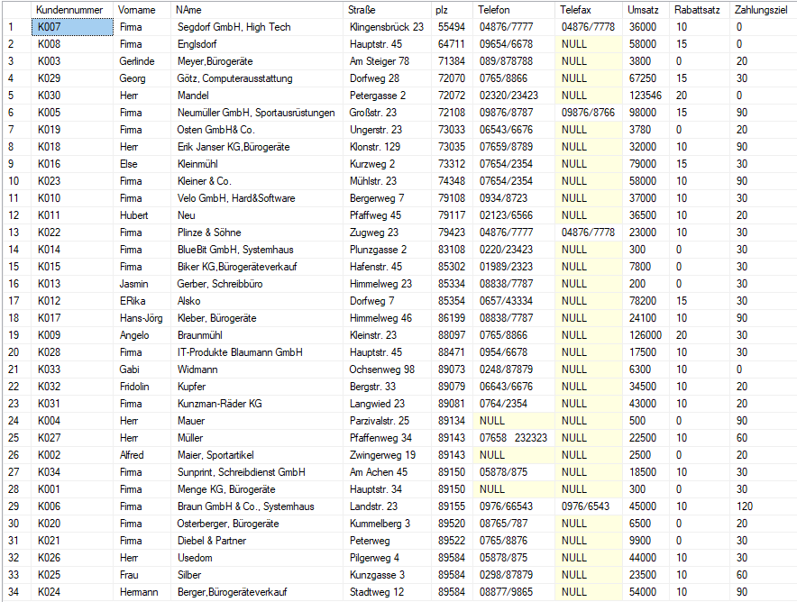
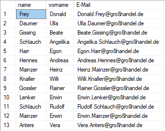
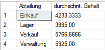
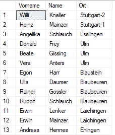
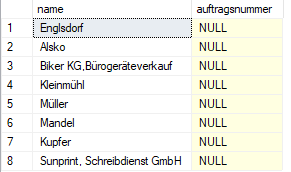

# Szenario
Du bist beauftragt, einem Datanbenkentwickler dabei zu helfen, Abfragen zu erstellen und seine parat erstellten Abfragen auf Richtigkeit zu prüfen.


Diese Datenbank gehört einer Großhandelfirma und besteht aus 7 tabellen (Mitarbeiter, Kunde, Eindeut_plz, Artikel, Artikelgruppen, Auftrag und Auftragsposition).

Du brauchst die Datenbank bei dir lokal zu erstellen. Dafür kannst du die Datei [SQL_Quizze_Initial_Database.sql](SQL_Quizze_Initial_Database.sql) verwenden
# Voraussetzungen
-   Du hast eine Oracle Datenbank Instanz in Docker gestartet. (Du kannst dieses Image nutzen [gvenzl/oracle-xe](https://hub.docker.com/r/gvenzl/oracle-xe))
-   Du hast das Skript in der Datenbank ausgeführt und alle Objekte erstellt.
-   Du hast ein Programm, mit dem du dich mit Oracle Datenbank verbinden kannst und die Datenbank Tabellen abfragen kannst (z. B. [Oracle SQL Developer](https://www.oracle.com/tools/downloads/sqldev-downloads.html)) 

# Start
Verbinde dich mit der Oracle Instanz und starte eine Query Session.

# Aufgaben
## Stufe 1:
1. Zeige alle Informationen der Tabelle Mitarbeiter. Wie viele Mitarbeiter beschäftigt die Firma?
2.  Sortiere die Kundendaten nach der Postleitzahl aufsteigend. Bei der gleichen Postleitzahl werden die Datensätze nach Kundenamen absteigend sortiert.
So soll das Ergebnis aussehen:

3. Welcher Mitarbeiter der Steuerklasse III verdient mehr als 6000 €
4. Welche der folgenden Abfragen liefert folgende Tabelle zurück:


- `SELECT Name, Vorname, Vorname + '.' + Name + '@großhandel.de' AS E-Mail FROM Mitarbeiter`
- `SELECT Name, Vorname, Vorname + '.' + Name + '@großhandel.de' AS "E-Mail" FROM Mitarbeiter`
- `SELECT Name, Vorname, Vorname + . + Name + @großhandel.de AS E-Mail FROM Mitarbeiter`
- Keine
## Stufe 2:
1. Wie groß ist das Minimal- bzw. das Maximalgehalt in der Firma?
2. Mit welcher der folgenden Skripte können Aufträge, die im Jahr 1999 aufgenommen wurden abgefragt?

- a
```
SELECT count(*) AS [Aufträge Anzahl]
FROM Auftrag
HAVING YEAR(Auftragsdatum) = 1999;
```

- b
```
SELECT count(Auftragsnummer) AS [Aufträge Anzahl]
FROM Auftrag
HAVING YEAR(Auftragsdatum) = 1999;
```
- c
```
SELECT count(*) AS [Aufträge Anzahl]
FROM Auftrag
WHERE YEAR(Auftragsdatum) = 1999;
```
- d
```
SELECT count(Auftragsdatum)
FROM Auftrag
WHERE YEAR(Auftragsdatum) = 1999;
```

3. Eine der folgenden Abfragen liefert folgendes Ergebnis zurück:


- a `SELECT Abteilung, AVG(Gehalt) "durchschnt. Gehalt" FROM MITARBEITER;`
- b `SELECT Abteilung, AVG(Gehalt) "durchschnt. Gehalt" FROM MITARBEITER
GROUP BY Gehalt;`
- c `SELECT Abteilung, AVG(Gehalt) durchschnt. Gehalt FROM MITARBEITER
GROUP BY Abteilung;`
- d `SELECT Abteilung, AVG(Gehalt) "durchschnt. Gehalt" FROM MITARBEITER
GROUP BY Abteilung;`
4. Welche Steurklassen kommen in der Mitarbeiter Tabelle mehr als 4 Mal vor?
## Stufe 3:
1. Welche Artikel gehören zur Artikelgruppe mit der Bezeichnung „Peripherie“?

2. Mit welcher der Abfragen bekommst du das abgebildete Ergebnis?


- a
```
SELECT m.Vorname, m.Name, ep.Ort FROM MITARBEITER m
RIGHT JOIN EINDEUT_PLZ ep ON ep.PLZ = m.Plz
```
- b
```
SELECT m.Vorname, m.Name, ep.Ort FROM MITARBEITER m
JOIN EINDEUT_PLZ ep ON ep.PLZ = m.Plz
```
- c
```
SELECT m.Vorname, m.Name, ep.Ort FROM EINDEUT_PLZ ep
LEFT JOIN MITARBEITER m ON ep.PLZ = m.Plz
```
- d
```
SELECT m.Vorname, m.Name, ep.Ort FROM EINDEUT_PLZ ep
RIGHT JOIN MITARBEITER m ON ep.PLZ = m.Plz
```
3. In Welchen Orten Wohnen sowohl Kunde als auch Mitarbeiter ? (Nur die Orte müssen angezeigt werden)
4. Folgende Abbildung zeigt Kunden an, die noch nicht etwas bestellt haben.



Wie lautet die Abfrage für diese Tabelle?

# Autor
Name: Ali Ahmad